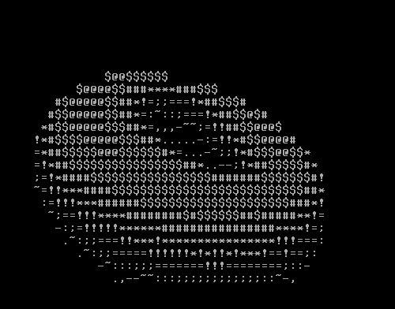

# x86-bare-metal-donut

Andy Sloane's [donut.c](https://www.a1k0n.net/2006/09/15/obfuscated-c-donut.html) ported to x86 bare-metal environments



## How to run

First, install dependencies:

```sh
# on Ubuntu
sudo apt install gcc-multilib grub2 mtools xorriso qemu-system-x86
```

Then run the following command to build and run:

```
make run
```

It also creates a disk image file called `disk_image`. You can simply copy it onto a disk and boot it.

## Notes

The [donut.c](src/donut.c) is [the revised version](https://www.a1k0n.net/2021/01/13/optimizing-donut.html) without any modification.

For the explanation of how `donut.c` works, see [Andy Sloane's blog post](https://www.a1k0n.net/2011/07/20/donut-math.html).
